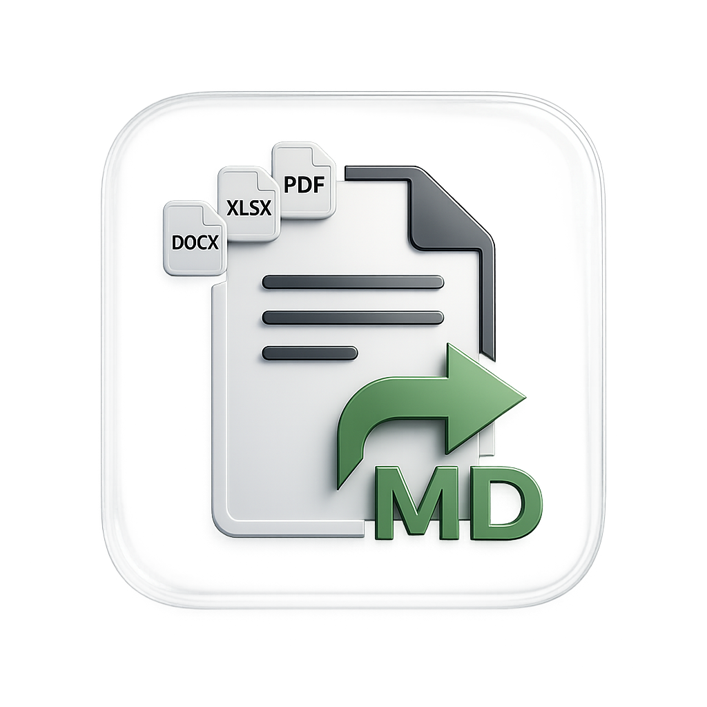
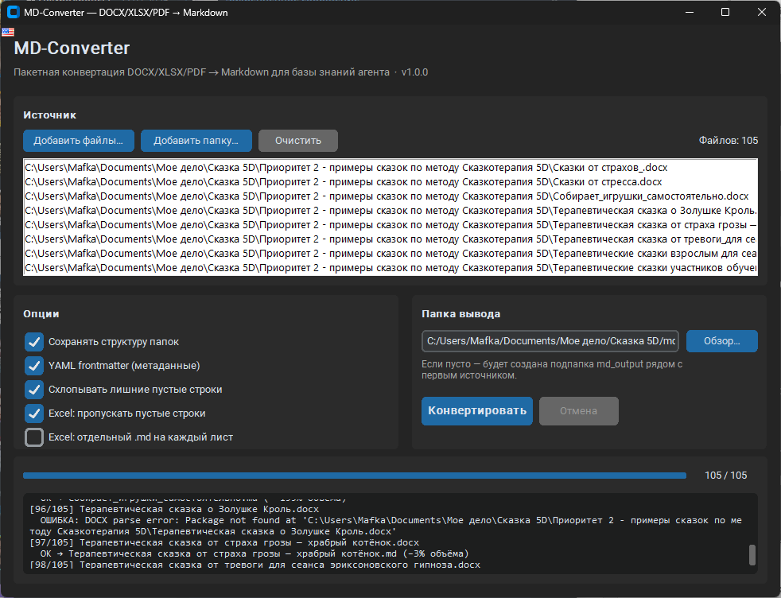

# MD-Converter

<p align="center">
  
</p>

Windows GUI-приложение для **пакетной** конвертации документов в чистый **Markdown**, оптимизированный по объёму для базы знаний AI-агента.

**Поддерживаемые форматы:** `.docx` · `.xlsx` · `.pdf`

## Скриншот



---

## Зачем это нужно

Офисные форматы (DOCX/XLSX/PDF) тяжёлые и плохо подходят для RAG и контекста LLM. Markdown:

- заметно меньше по размеру (часто на порядок);
- сохраняет структуру: заголовки, списки, таблицы;
- удобно индексировать и отдавать агенту.

MD-Converter делает пакетную структурную конвертацию **без LLM** — быстро и предсказуемо.

## Возможности

| Область | Что умеет |
|--------|-----------|
| **Пакетная обработка** | Файлы и папки, рекурсивный обход, прогресс и журнал |
| **DOCX** | Заголовки, bold/italic, списки, таблицы GFM, гиперссылки |
| **XLSX** | Все листы, пропуск пустых строк, один `.md` на книгу или на лист |
| **PDF** | Текст, эвристика заголовков по размеру шрифта, таблицы (PyMuPDF), секции по страницам |
| **Оптимизация** | Без base64-картинок, схлопывание пустых строк, YAML frontmatter |
| **Надёжность** | Ошибка в одном файле не останавливает весь пакет |
| **Сборка** | PyInstaller → `MD-Converter.exe` |

## Требования

- Windows 10/11
- Python **3.11+** (для запуска из исходников)

## Быстрый старт

```powershell
git clone https://github.com/neuromafka-create/MD-Converter.git
cd MD-Converter
python -m venv .venv
.\.venv\Scripts\Activate.ps1
pip install -r requirements.txt
python main.py
```

### Как пользоваться

1. **Добавить файлы** или **Добавить папку** (`.docx` / `.xlsx` / `.pdf`)
2. Указать **папку вывода** (если пусто — создаётся `md_output` рядом с источником)
3. При необходимости настроить опции
4. Нажать **Конвертировать**

## Опции конвертации

| Опция | Описание |
|--------|----------|
| Сохранять структуру папок | Зеркалировать дерево каталогов в выводе |
| YAML frontmatter | Метаданные: `title`, `source`, `type`, `converted_at` (+ `pages` для PDF) |
| Схлопывать пустые строки | Уменьшает шум в Markdown |
| Excel: пустые строки | Не писать полностью пустые ряды |
| Excel: файл на лист | Отдельный `.md` для каждого листа книги |
| Перезаписывать `.md` | Иначе добавляется суффикс `_1`, `_2`, … |
| Картинки (DOCX/PDF) | Плейсхолдер `` или пропуск (base64 **не** встраивается) |

## Пример результата

**Вход:** `reglament.docx` + `catalog.xlsx`  
**Выход:** компактные `.md` с frontmatter и таблицами GFM.

```markdown
---
title: "catalog"
source: "C:/docs/catalog.xlsx"
type: xlsx
converted_at: "2026-07-31T13:40:36"
---

# catalog

## Каталог

| SKU | Название | Цена |
| --- | --- | --- |
| A1  | Винт     | 12.5 |
| A2  | Гайка    | 3    |
```

## Зависимости

| Пакет | Назначение |
|--------|------------|
| `customtkinter` | GUI |
| `python-docx` | Чтение Word |
| `openpyxl` | Чтение Excel |
| `pymupdf` | Чтение PDF |
| `Pillow` | Зависимость CustomTkinter |
| `pytest` | Тесты |
| `pyinstaller` | Сборка `.exe` |

Полный список: [`requirements.txt`](requirements.txt).

## Тесты

```powershell
pytest -q
```

## Сборка и инсталлятор (Windows)

### Полная сборка (рекомендуется)

Собирает `MD-Converter.exe` (PyInstaller) и установщик **Setup** (Inno Setup 6):

```powershell
pip install -r requirements.txt
# Нужен Inno Setup 6 (один раз):
# winget install --id JRSoftware.InnoSetup -e

.\scripts\build_installer.ps1
```

Результаты:

| Файл | Назначение |
|------|------------|
| `dist\MD-Converter.exe` | Portable-запуск без установки |
| `dist\installer\MD-Converter-Setup-1.0.0.exe` | Инсталлятор для пользователей |

Инсталлятор:

- ставит приложение в `%LocalAppData%\Programs\MD-Converter` (без обязательных прав администратора);
- создаёт ярлыки в меню «Пуск» (и опционально на рабочем столе);
- добавляет запись в «Установка и удаление программ»;
- поддерживает русский и английский язык мастера.

### Только EXE

```powershell
pyinstaller build.spec
# → dist\MD-Converter.exe
```

### Только инсталлятор (если EXE уже собран)

```powershell
.\scripts\build_installer.ps1 -SkipPyInstaller
```

## Структура проекта

```
MD-Converter/
├── main.py                 # Точка входа
├── requirements.txt
├── build.spec              # PyInstaller
├── assets/
│   ├── logo.png            # Логотип / иконка GUI
│   └── logo.ico            # Иконка EXE и установщика
├── docs/
│   └── screenshot.png      # Скриншот для README
├── installer/
│   └── MD-Converter.iss    # Inno Setup: Windows-инсталлятор
├── scripts/
│   └── build_installer.ps1 # Сборка EXE + Setup
├── app/
│   ├── config.py           # Константы, поддерживаемые расширения
│   ├── models.py           # ConvertOptions, FileJob, результаты
│   ├── gui/                # CustomTkinter UI
│   ├── converters/         # DOCX / XLSX / PDF → Markdown
│   ├── core/               # scanner, batch, optimize
│   └── utils/              # GFM-таблицы, пути, frontmatter
└── tests/
```

### Поток данных

```
Файлы / папка → scanner → batch worker
    → converter (docx | xlsx | pdf) → optimize → .md
    → лог + статистика сжатия
```

## Ограничения

- Нет legacy `.doc` / `.xls` (только Office Open XML и PDF)
- PDF **без текстового слоя** (сканы) — текст не извлекается; OCR пока не реализован
- Сложные нумерации Word и экзотическая вёрстка PDF — best-effort
- Нет LLM-суммаризации (только структурная конвертация)
- Зашифрованные PDF без пустого пароля не открываются

## Roadmap (идеи)

- [ ] OCR для сканов (Tesseract / Windows OCR)
- [ ] CLI-режим для пайплайнов
- [ ] `.pptx`, legacy Office через LibreOffice
- [ ] Drag-and-drop в GUI
- [ ] Сохранение пресетов настроек

## Лицензия

MIT
